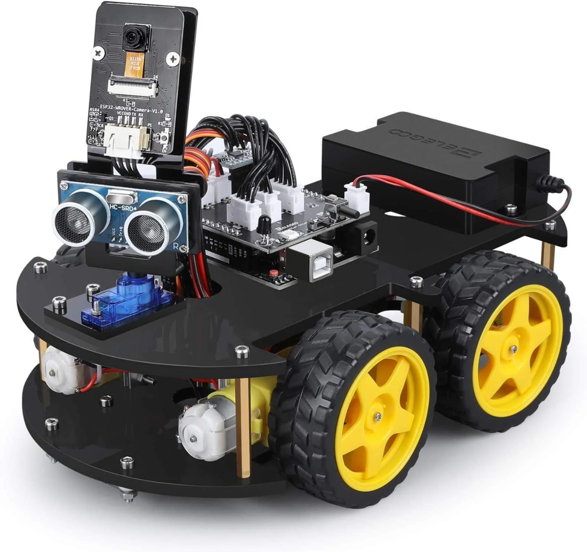

# Robotics 1 - A Smart Robot Car Project

  

## Description

This project was inspired from the `University of Malta` 's `Robotics 1` study unit for the course of `B.Sc. (Hons) in Artificial Intelligence`. The project was entirely constructed from a recreational perspective as to learn the basics of robotics and to have fun with it. The project was done solely by me, `Matthias Bartolo`, and I am proud to say that I have learned a lot from this project, especially when working with the `Arduino` platform and assembling the robot car. The project was done in the year 2024. Finally, I wish to express my sincere gratitude to Dr. Ingrid Galea, who, despite not being directly involved in supervising this project, generously provided me with the necessary support and resources, enabling me to meet the challenges and successfully complete it.

## What is a Robot?

The term `“robot”` often evokes imagery of anthropomorphic features, such as robotic “arms” employed in welding tasks. The tendency to assign human-like traits to robots may find its roots in the origin of the term `“robot”`, coined by a Czech playwright in 1920. This term, derived from the Czech word `“robota”` meaning forced labour, suggests a historical association between robots and laborious tasks in his plays. This inclination is in alignment with the definition provided by the Robot Institute of America, which widely acknowledges a robot as a `“reprogrammable, multifunctional manipulator designed to move material, parts, tools, or specialized devices through variable programmed motions for the performance of a variety of tasks”`. The evolution from human-like mechanical constructs to a broader range of forms suitable for diverse tasks reflects the pragmatic realities of robotics. While inherently mechanical, robots need not adhere to anthropomorphic or even animalistic designs.

## Components of a Robotic System

A robotic system’s three main components as illustrated below, are `sensors`, `actuators`, and `controllers`. These components comprise the backbone of the system’s planning process, allowing it to interact with the environment. Sensors act as the robot’s sensory organs, collecting data from the surroundings using a variety of techniques such as cameras, lidars, and proximity sensors. Actuators, on the other hand, execute physical actions depending on controller instructions. These actions might be as basic as spinning a wheel or as sophisticated as grasping an item. The controllers serve as the operation’s brain, analysing sensor data, making judgements,
and issuing orders to actuators to complete tasks. Together, these components interact dynamically with their surroundings, constantly collecting feedback from sensors, analysing information, and modifying actions accordingly.
 

  

## Robot Description

The smart robot car as depicted above represents the assembled robotic platform
utilised for this project. This robot consists of a four-wheeled motorised chassis, incorporating sensory components such as an ultrasonic (sonar) sensor and a camera module, both of which are mounted on servo motors to enable directional movement. The system is integrated on an Arduino Uno board with an IO Expansion Board, enhancing its connectivity and functionality. Additionally, the robot features a line tracking module, enabling preset modes including line-tracking, obstacle avoidance, and auto-follow functionalities. Additionally, the robot’s capabilities, including real-time detection and measurement of orientation, rotation, and angular velocity, are enhanced by the inclusion of the MPU6050 gyro module. Power is supplied by a rechargeable lithium battery, ensuring sustained operation of the system.

## Robot Assembly

The assembly process commenced with the attachment of motors using the
provided screws, ensuring each was securely fastened to the robot’s bottom plate following the assembly instructions provided with the kit. Following this, the line-tracking module was affixed beneath the bottom plate and firmly secured. Subsequent steps involved the integration of chips into the system: first, the MPU6050 gyro chip was connected to the expansion board, followed by the Arduino Uno chip, all of which were affixed to the robot’s top plate. The lithium battery was then securely mounted onto the top plate. Assembly of the camera module entailed connecting the camera to its bracket, while the ultrasonic sensor was connected to the servo module; both components were then joined and fixed onto the robot’s top plate. Next, the various robot components were connected to the IO Expansion board using a set of wires, following the kit’s instructions. Finally, the top and bottom plates were
joined together using a set of six copper cylinders. To complete the assembly, the wheels were connected to the robot and firmly screwed onto the motors. Illustrated below are the labelled components of the aforementioned smart robot car.

  

## Software Installation

In the software installation process, the initial step involved installing the [Arduino IDE](https://www.arduino.cc/en/software) followed by downloading the system through the installation setup wizard. Subsequently, the specified zip libraries from the robot kit’s package files were added
to the system by navigating to `Sketch -> Include Library -> Add .ZIP Library` on the Arduino IDE. These libraries which are available in the [Libraries](Libraries) folder include the `FastLED`, `IRremote`, `I2Cdev`, `NewPing`, and `Pitches` libraries. Additionally, note that the robot demos used in this project are compatible with the `TB6612 & MPU6050 chip set`. The other demos are designed for alternative chips. The final step involved connecting the Arduino Uno board to the computer using a USB cable and selecting the appropriate board and port from the `Tools` menu on the Arduino IDE. The system was then uploaded to the Arduino Uno board by clicking the `Upload` button on the IDE.

## Programming Basic Movement

To enable fundamental locomotion, a program was devised to command the robot’s
motion: moving forward for 5 seconds, then backward for 5 seconds, before coming to a halt. This functionality was achieved through encoding and uploading specific commands to the Arduino Uno board. Within the setup function, critical components and configurations essential for robotic operation were initialised. This entailed establishing serial communication, defining pin assignments for motors, tracking sensors, and an ultrasonic sensor, and setting their respective modes. Moreover, the accelerometer and gyroscope components underwent calibration, while the I2C communication bus was initialised. Additionally, the servo mechanism was calibrated to orient the robot forward, with its current angle recorded for reference. Although the
sensors and servo motor were not utilised in this step, it is generally well-known practice to define these in the setup function. Within the loop function, the robot executed a predefined sequence of actions. It began by retrieving its current orientation using the MPU6050 sensor, then propelled forward for 5 seconds via the fwd function. Following a brief pause, it reversed direction for 5 seconds using the bwd function, culminating in a 10-second stationary interval before repeating the cycle.

## Ultrasonic Sensor Analysis Experiment

In this experiment, the primary focus was dedicated to scrutinising the functionality of the Ultrasonic Sensor. In pursuit of this objective, a series of observations were recorded. The experimental setup involved investigating the sensor’s response to dynamic stimuli, particularly by placing an object (which can be detected by the sensor) in front of the sensor and systematically varying its proximity to the robot in order to discern whether it is detected or not. Notably, the Ultrasonic Sensor demonstrated the
capability of registering the furthest obstacle at a distance of 1183 centimetres, while discerning objects as close as 2 centimetres. The analysis also included an examination of the sensor's field of view (FOV), depicted below. The cone-shaped region delineates the sensor's detection range and coverage, while unmarked areas on the plot denote blind spots.

  

## Obstacle Detection Experiment

This experiment encompassed the development of a rudimentary obstacle detection
algorithm, wherein the robot was programmed to advance for a duration of 10 seconds but promptly halt upon detecting an obstacle within a 20-centimetre proximity of the Ultrasonic Sensor. The procedural workflow as seen eblow, wherein the initial image portrays the robot’s forward movement towards the obstacle, while the subsequent image illustrates the robot’s cessation upon detecting an obstacle within the prescribed 20-centimetre range. Furthermore, observations revealed inherent constraints regarding the positioning of the ultrasonic sensor on the robot. Notably, due to its elevated placement as recommended by the provided kit components, certain obstacles were not readily detected. This limitation stemmed from the necessity for both the transmitter and receiver to directly face the detected obstacle for optimal sensor functionality, highlighting the practical challenges inherent in
deploying the robot within complex environments characterised by diminutive
obstacles. It is essential to underscore that these limitations primarily originate from hardware constraints rather than programming deficiencies.

<table align="center">
  <tr>
    <td align="center">
      
    </td>
    <td align="center">
      
    </td>
  </tr>
</table>

https://github.com/mbar0075/Robotics-1-A-Smart-Robot-Car-Project/assets/103250564/ea0a58f1-35f8-4f7f-b35e-270eb59dc190

## Obstacle Avoidance Experiment

This experiment progressed from the preceding phase of obstacle detection to the subsequent stage of evading the identified objects. The algorithm devised for obstacle avoidance drew inspiration from the pre-existing algorithm packaged with the robot kit, albeit with enhancements introducing a degree of randomness in robot movement. In the initial image illustrated below, the ultrasonic sensor detects the obstacle, prompting the servo motor to tilt the sensor to the right. Subsequently, in the succeeding image, the robot manoeuvres in the direction of the tilted angle, effectively circumventing the
obstacle and averting collision. Furthermore, it is notable that the challenge of sensor positioning manifests in certain scenarios, wherein diminutive obstacles fail to prompt the robot to halt, resulting in various collisions. Amidst the algorithm’s development, a persistent challenge pertained to coordinating the movement of the servo motor and determining optimal angles. This hurdle was surmounted through observation of the chosen hyper-parameters by the ELEGOO kit, which demonstrated smooth and fluid movement as the robot adjusted its angle. Additionally, the current algorithm incorporates a slight reversal of the robot’s movement before executing a turn, thereby ensuring a wide arc of rotation without collision. Moreover, a robot speed of 100 units
was chosen for this avoidance manoeuvre, with the closest distance for obstacle
detection set at 20 units to afford the robot ample time for halting, reversing, and evading the obstacle effectively.

<table align="center">
  <tr>
    <td align="center">
      
    </td>
    <td align="center">
      
    </td>
  </tr>
</table>

https://github.com/mbar0075/Robotics-1-A-Smart-Robot-Car-Project/assets/103250564/a2ee47f7-19a6-4ccb-abd4-824e7d86d832

